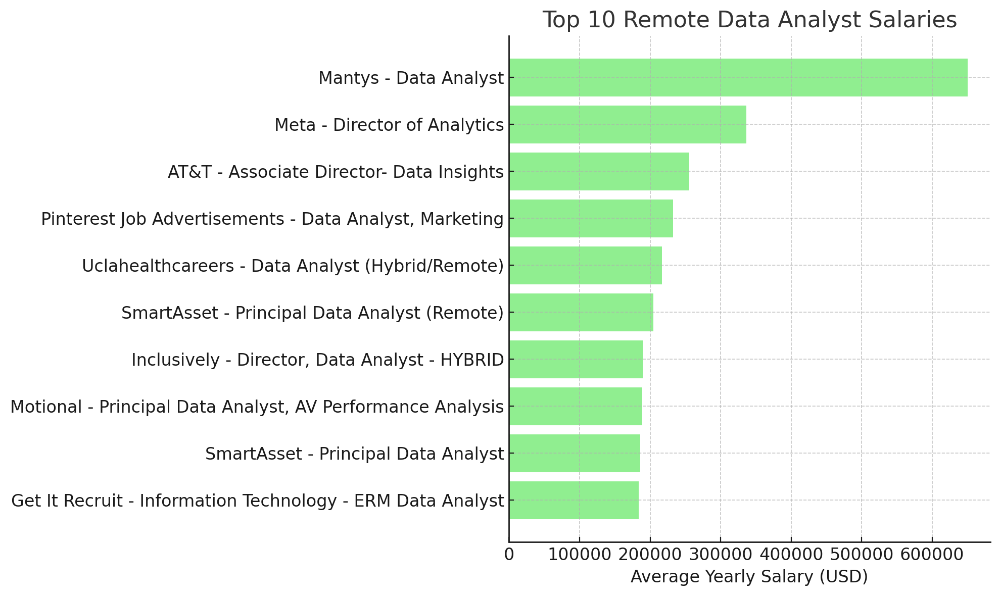
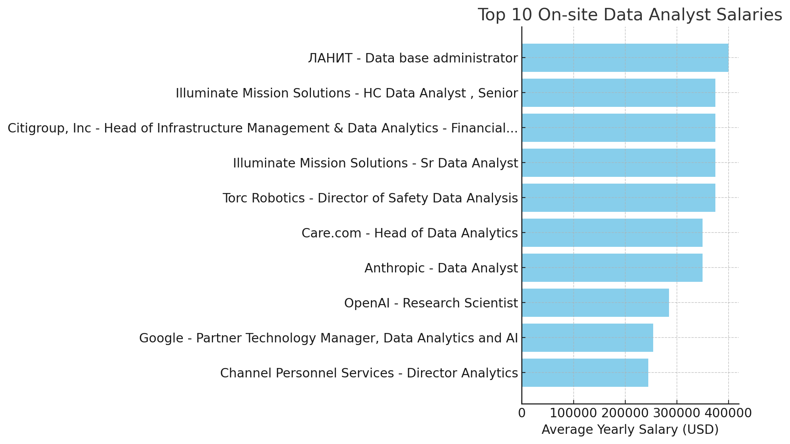

# 📄 Introduction
โปรเจกต์นี้เป็นการวิเคราะห์ Dataset เกี่ยวกับตลาดงานสาย Data (ข้อมูลจากปี 2023) โดยโฟกัสที่ตำแหน่ง Data Analyst เพื่อค้นหาแนวโน้มสำคัญ เช่น

- งานหรือตำแหน่งใดที่มีรายได้สูงที่สุด 💰

- ทักษะที่เป็นที่ต้องการมากที่สุด 🔥

- ความเชื่อมโยงระหว่าง ทักษะที่มีความต้องการสูง กับ ระดับเงินเดือนที่สูง 📈

Dataset ที่ใช้ในการวิเคราะห์นี้ได้มาจาก Workshop ของคอร์สออนไลน์บน YouTube โดยคุณ [Luke Barousse](https://www.youtube.com/watch?v=7mz73uXD9DA&t=3096s)

# 📝 Backgroud
เพื่อฝึกฝนและพัฒนาทักษะด้าน SQL ผมได้ศึกษาและเรียนรู้การใช้งาน SQL สำหรับการค้นหาและวิเคราะห์ข้อมูล ผ่านคอร์สออนไลน์บน YouTube และได้เจอกับคอนเทนต์จาก Luke Barousse ซึ่งเป็นจุดเริ่มต้นให้ผมสนใจและลงมือทำโปรเจกต์ด้านการวิเคราะห์ข้อมูลมากขึ้น โดยคำถามเพื่อการวิเคราะห์ข้อมูลจะเป็นคำถามจากในคอร์สเป็นส่วนใหญ่

1. งาน Data Analyst ตำแหน่งใดที่มีรายได้สูงที่สุด?

2. ทักษะใดบ้างที่จำเป็นสำหรับงาน Data Analyst ที่มีรายได้สูงเหล่านี้?

3. ทักษะใดที่เป็นที่ต้องการมากที่สุดสำหรับ Data Analyst?

4. ทักษะใดที่เชื่อมโยงกับการได้รับเงินเดือนสูงกว่า?

5. ทักษะใดคือทักษะที่เหมาะสมที่สุดในการเรียนรู้?

# 🔧 Tools I Used
โดยการที่จะสามารถลงไปค้นหาข้อมูลจาก Data Analyst Job Market ผมได้ใช้เครื่องมื่อดังต่อไปนี้

- SQL : Structured Query Language เป็นเครื่องมือที่สำคัญหลักๆ โดยผมจะใช้ SQL เพื่อทำการ query ข้อมูลจาก database ในการค้นหาข้อมูลที่ต้องการ และนำมาทำการวิเคราะห์

- PostgreSQL : เป็น Database Management System เพื่อใช้ในการจัดเก็บและจัดการกับข้อมูล

- Visual Studio Code : ใช้ในการเชื่อมต่อกับ Database และทำการเขียน SQL เพื่อ executing queries

- Git & Github : ควบคุมเวอร์ชันและการแชร์สคริปต์ SQL ในการวิเคราะห์ของผม เพื่อให้มั่นใจว่ามีการทำงานร่วมกันและการติดตามโปรเจกต์ได้อย่างต่อเนื่อง

# 📈 The Analysis
แต่ละการ query ข้อมูลในโปรเจกต์นี้จะเป็นการสืบค้นเจาะจงไปที่ตลาดงานของ Data Analyst โดยจะมีแต่ละคำถามดังนี้
#### 📌 1. งาน Data Analyst ตำแหน่งใดที่มีรายได้สูงที่สุด?
เพื่อที่จะหาตำแหน่งงานที่รายได้สูงที่สุดของ Data Analyst ผมจึงทำการกรอกข้อมูลเฉพาะตำแหน่งงาน Data Analyst และ เรียงลำดับรายได้จากสูงสุดไปต่ำสุด กับสถานที่ทำงานโดยมุ่งไปที่งานที่สามารถ work from home ได้ โดยเลือกมาแค่ 10 อันดับแรกเท่านั้น

```sql
SELECT
    job_id,
    name AS company_name,
    job_title,
    job_location,
    job_schedule_type,
    salary_year_avg,
    job_posted_date
FROM
    job_postings_fact jpf
LEFT JOIN
    company_dim cd ON cd.company_id = jpf.company_id
WHERE
    job_title_short = 'Data Analyst' AND job_work_from_home = TRUE AND salary_year_avg IS NOT NULL
ORDER BY
    salary_year_avg DESC
LIMIT
    10
```
สามารถวิเคราะห์ออกมาได้ดังนี้
- **ช่วงเงินเดือนที่กว้าง** : จากข้อมูล 10 อันดับของตำแหน่งงาน Data Analyst รายได้ต่ำสุดของ 10 อันดับคือ 184,000 ดอลลาร์ ไปจนถึงอันดับ 1 คือ $650,000 ดอลลาร์ แสดงให้เห็นถึงศักยภาพด้านรายได้ที่สูงในสายงาน

- **หลากหลายบริษัท** : บริษัทอย่าง SmartAsset, Meta และ AT&T เป็นหนึ่งในองค์กรที่ให้เงินเดือนสูง สะท้อนถึงความสนใจในสายงาน Data Analytics ที่กระจายอยู่ในหลายอุตสาหกรรม

- **ตำแหน่งงานที่หลากหลาย** : มีความหลากหลายของชื่อตำแหน่ง ตั้งแต่ Data Analyst ไปจนถึง Director of Analytics ซึ่งสะท้อนถึงบทบาทและความเชี่ยวชาญที่แตกต่างกันภายในสายงาน Data Analytics

นอกจากนี้ผมยังทำการเปรียบเทียบกับ 10 อันดับงานที่เป็นแบบ Onsite โดย SQL query จะเหมือนกับด้านบนแค่จะเปลี่ยนเงื่อนไขการค้นหาข้อมูลเป็นแบบ Onsite 

```sql
SELECT
    job_id,
    name AS company_name,
    job_title,
    job_location,
    job_schedule_type,
    salary_year_avg,
    job_posted_date
FROM
    job_postings_fact jpf
LEFT JOIN
    company_dim cd ON cd.company_id = jpf.company_id
WHERE
    job_title_short = 'Data Analyst' AND job_work_from_home = FALSE AND salary_year_avg IS NOT NULL
ORDER BY
    salary_year_avg DESC
LIMIT
    10;
```
สามารถวิเคราะห์ออกมาได้ดังนี้

- **ช่วงของรายได้** : งาน Remote มี เพดานสูงกว่า (650k vs 400k) แต่กระจายกว้างและค่าเฉลี่ยต่ำกว่า On-site Remote มี Outlier เช่น Mantys 650k ดึงค่าเพดานขึ้น และ On-site เงินเดือนค่อนข้างนิ่งกว่า อยู่ช่วง 245k–400k แต่มักจะจ้างตำแหน่งระดับสูง/ผู้นำในองค์กรใหญ่ เช่น (Google, OpenAI, Citigroup)

- **ความหลากหลายของบริษัท** : เหมือนกับงาน Remote เพราะมีสายงาน Data Analytics ที่กระจายอยู่ในหลายอุตสาหกรรมซึ่งหมายถึงสะท้อนถึงความสนใจในสายงาน Data Analytics ในหลายอุตสาหกรรม

- **ตำแหน่งงานที่หลากหลาย** : มีความหลากหลายของชื่อตำแหน่ง แต่ตำแหน่งกว้าง บางงานไม่ใช่ Analyst ตรงๆ (เช่น Research Scientist, Head of Infrastructure)




*Both bar graph (on-site and remote) ที่แสดงให้เห็นถึง 10 อันดับรายได้สูงสุดของตำแหน่ง Data Analyst generated โดย ChatGPT จากผลลัพธ์ของ SQL query*

#### 📌 2. ทักษะใดบ้างที่จำเป็นสำหรับงาน Data Analyst ที่มีรายได้สูงเหล่านี้?
เพื่อทำความเข้าใจเกี่ยวกับทักษะที่จำเป็นในตำแหน่งงานที่มีรายได้สูง จึงทำการนำตารางที่เก็บข้อมูลเกี่ยวกับการจ้างงาน มารวมกับตารางที่เก็บข้อมูลเกี่ยวกับทักษะต่างๆ เพื่อที่จะสามารถหาข้อมูลเชิงลึกได้

```sql
WITH top_paying_jobs AS (
    SELECT
        job_id,
        name AS company_name,
        job_title,
        salary_year_avg
    FROM
        job_postings_fact jpf
    LEFT JOIN
        company_dim cd ON cd.company_id = jpf.company_id
    WHERE
        job_title_short = 'Data Analyst'
        AND job_work_from_home = TRUE
        AND salary_year_avg IS NOT NULL
    ORDER BY
        salary_year_avg DESC
    LIMIT
        10
)
SELECT
    tpj.*,
    sd.skills
FROM
    top_paying_jobs tpj
INNER JOIN
    skills_job_dim sjd ON sjd.job_id = tpj.job_id
INNER JOIN
    skills_dim sd ON sd.skill_id = sjd.skill_id
ORDER BY
    tpj.salary_year_avg DESC
```
สามารถจำแนกข้อมูลทักษะที่จำเป็นจากข้อมูลของ 10 อันดับตำแหน่งงานที่รายได้สูงสุดได้ดังนี้

- **SQL** เป็นอันดับที่ 1 ด้วยการมีความต้องการถึง 8 บริษัท

- **Python** เป็นอันดับที่ 2 ใกล้เคียงกับ SQL ด้วยการมีความต้องการถึง 7 บริษัท

- **Tableau** เป็นอันดับที่ 3 จากทักษะที่มีความต้องการสูงสุด ตามมาด้วย R, Snowflake, Pandas และ Excel ที่มีความต้องการรองลงมา

| Skills     | Frequency |
|------------|-----------|
| SQL        | 8         |
| Python     | 7         |
| Tableau    | 6         |
| R          | 4         |
| Snowflake  | 3         |
| Pandas     | 3         |
| Excel      | 3         |
| Atlassian  | 3         |
| Jira       | 2         |
| AWS        | 2         |

มาดูข้อมูลในส่วนของงานที่เป็นแบบ On-site กันบ้าง

| Skills   | Frequency |
|----------|-----------|
| Python   | 4         |
| SQL      | 3         |
| Excel    | 3         |
| Tableau  | 3         |
| R        | 3         |
| Power BI | 2         |
| SAS      | 2         |
| Looker   | 1         |
| Matlab   | 1         |
| Oracle   | 1         |

สังเกตได้ว่า ไม่ว่าจะเป็น SQL หรือ Python ทั้งสองทักษะนี้เป็นสิ่งที่ต้องการในสายงานเป็นอันดับต้นๆ

#### 📌 3. ทักษะใดที่เป็นที่ต้องการมากที่สุดสำหรับ Data Analyst?

SQL query นี้ช่วยให้เราสามารถหาค่าจำนวนของทักษะที่เป็นที่ต้องการของตลาดทั้งหมด

```sql
SELECT
    sd.skills,
    COUNT(sd.skills) AS demanded_count
FROM
    job_postings_fact jpf
INNER JOIN
    skills_job_dim sjd ON sjd.job_id = jpf.job_id
INNER JOIN
    skills_dim sd ON sd.skill_id = sjd.skill_id
WHERE
    jpf.job_title_short = 'Data Analyst'
    AND jpf.job_work_from_home = TRUE
GROUP BY
    sd.skills
ORDER BY
    demanded_count DESC
LIMIT
    5
```

| Skills   | Demand Count |
|----------|--------------|
| SQL      | 7291         |
| Excel    | 4611         |
| Python   | 4330         |
| Tableau  | 3745         |
| Power BI | 2609         |

จากข้อมูลด้านบนสามารถจำแนกข้อมูลได้ดังนี้

- SQL และ Excel ยังคงเป็นทักษะพื้นฐานที่สำคัญ ตอกย้ำถึงความจำเป็นในการมีรากฐานที่แข็งแรงด้านการประมวลผลข้อมูลและการจัดการสเปรดชีต

- Programming และ Visualization Tools อย่าง Python, Tableau และ Power BI ถือว่าเป็นสิ่งจำเป็น สะท้อนให้เห็นถึงความสำคัญที่เพิ่มขึ้นของทักษะทางเทคนิคในการเล่าเรื่องด้วยข้อมูล (Data Storytelling) และการสนับสนุนการตัดสินใจทางธุรกิจ

#### 4. ทักษะใดที่เชื่อมโยงกับการได้รับเงินเดือนสูงกว่า?

ค้นหาข้อมูลเกี่ยวกับรายได้เฉลี่ยของแต่ละทักษะนั้นๆ ว่าทักษะใดมีรายได้เฉลี่ยสูงสุด

```sql
SELECT
    sd.skills,
    ROUND(AVG(jpf.salary_year_avg), 0) AS average_salary
FROM
    job_postings_fact jpf
INNER JOIN
    skills_job_dim sjd ON sjd.job_id = jpf.job_id
INNER JOIN
    skills_dim sd ON sd.skill_id = sjd.skill_id
WHERE
    jpf.job_title_short = 'Data Analyst'
    AND jpf.salary_year_avg IS NOT NULL
    AND jpf.job_work_from_home = TRUE
GROUP BY
    sd.skills
ORDER BY
    average_salary DESC
LIMIT
    25
```

- **Big Data & ML Skills** : ทักษะด้าน Big Data (PySpark, Couchbase), Machine Learning (DataRobot, Jupyter) และ Python Libraries (Pandas, NumPy) เชื่อมโยงกับเงินเดือนสูง สะท้อนถึงคุณค่าที่อุตสาหกรรมให้ความสำคัญกับการประมวลผลข้อมูลและการสร้างโมเดลทำนาย

- **Development & Deployment** : ความรู้เครื่องมืออย่าง GitLab, Kubernetes, Airflow ช่วยเสริมศักยภาพ Data Analyst ให้ใกล้เคียง Data Engineer โดยเฉพาะทักษะที่ช่วยให้เกิดการทำงานอัตโนมัติและการจัดการ Data Pipeline อย่างมีประสิทธิภาพ

- **Cloud Computing** : ความเชี่ยวชาญเครื่องมือ Cloud และ Data Engineering (Elasticsearch, Databricks, GCP) ช่วยเพิ่มโอกาสรายได้สูงในสาย Data Analytics ตอกย้ำถึงความสำคัญที่เพิ่มขึ้นของสภาพแวดล้อมการวิเคราะห์บน Cloud


| Skills        | Average Salary ($) |
|---------------|-------------------:|
| pyspark       |            208,172 |
| bitbucket     |            189,155 |
| couchbase     |            160,515 |
| watson        |            160,515 |
| datarobot     |            155,486 |
| gitlab        |            154,500 |
| swift         |            153,750 |
| jupyter       |            152,777 |
| pandas        |            151,821 |
| elasticsearch |            145,000 |

#### 5. ทักษะใดคือทักษะที่เหมาะสมที่สุดในการเรียนรู้?
SQL query นี้ เพื่อระบุทักษะที่ทั้งมีความต้องการสูงและให้ค่าตอบแทนสูง เพื่อชี้แนวทางเชิงกลยุทธ์สำหรับการพัฒนาทักษะ

```sql
SELECT
    sd.skill_id,
    sd.skills,
    COUNT(sjd.job_id) AS demand_count,
    ROUND(AVG(jpf.salary_year_avg), 0) AS avg_salary
FROM
    job_postings_fact jpf
INNER JOIN
    skills_job_dim sjd ON sjd.job_id = jpf.job_id
INNER JOIN
    skills_dim sd ON sd.skill_id = sjd.skill_id
WHERE
    jpf.job_title_short = 'Data Analyst'
    AND jpf.salary_year_avg IS NOT NULL
    AND jpf.job_work_from_home = TRUE
GROUP BY
    sd.skill_id
HAVING
    COUNT(sjd.job_id) > 10
ORDER BY
    avg_salary DESC,
    demand_count DESC
LIMIT 25
```

| Skills      | Demand Count | Average Salary ($) |
|-------------|--------------|---------------------|
| Go          | 27           | 115,320             |
| Confluence  | 11           | 114,210             |
| Hadoop      | 22           | 113,193             |
| Snowflake   | 37           | 112,948             |
| Azure       | 34           | 111,225             |
| BigQuery    | 13           | 109,654             |
| AWS         | 32           | 108,317             |
| Java        | 17           | 106,906             |
| SSIS        | 12           | 106,683             |
| Jira        | 20           | 104,918             |
| Oracle      | 37           | 104,534             |
| Looker      | 49           | 103,795             |
| NoSQL       | 13           | 101,414             |
| Python      | 236          | 101,397             |
| R           | 148          | 100,499             |
| Redshift    | 16           | 99,936              |
| Qlik        | 13           | 99,631              |
| Tableau     | 230          | 99,288              |
| SSRS        | 14           | 99,171              |
| Spark       | 13           | 99,077              |
| C++         | 11           | 98,958              |
| SAS         | 63           | 98,902              |
| SQL Server  | 35           | 97,786              |
| JavaScript  | 20           | 97,587              |

- **Programming Languages** : Python (236) และ R (148) มีความต้องการสูง เงินเดือนเฉลี่ยประมาณ $101K และ $100K

- **Cloud Tools** : Snowflake, Azure, AWS, BigQuery – ความต้องการสูงและเงินเดือนเฉลี่ยสูง

- **BI & Visualization** : Tableau (230) และ Looker (49) – เงินเดือนเฉลี่ย $99K–$103K, เน้น Data Visualization และ BI

- **Database Technologies** : Oracle, SQL Server, NoSQL – เงินเดือนเฉลี่ย $97K–$104K, เน้นการจัดเก็บและจัดการข้อมูล

# what I Learned

จากการทำ Workshop ใน Course นี้ทำให้ผมได้ฝึกฝนทักษะ SQL ดังนี้

- **🧩 Complex Query Crafting** : จาก query ต่างๆที่ได้ทำการเขียนมาได้ฝึกการใช้ CTE โดยการใช้ WITH เพื่อ สร้างกลุ่มตารางข้อมูล เพื่อทำการรวมตารางที่ต้องการเข้าด้วยกัน

- **📊 Data Aggregation** : ใช้ GROUP BY และฟังก์ชันรวม เช่น COUNT(), AVG() ในการสรุปข้อมูลอย่างชาญฉลาด

- **💡 Analytical Wizardry** : พัฒนาทักษะการแก้ปัญหาเชิงวิเคราะห์จริง ๆ แปลงคำถามให้เป็น SQL Query ที่ได้ผลลัพธ์เชิงลึกและนำไปใช้ได้

# Conclusion

### Insights

จากคำถามเพื่อการวิเคราะห์ทั้ง 5 ข้อ สรุปได้ดังนี้

1. **งาน Data Analyst ตำแหน่งใดที่มีรายได้สูงที่สุด** : ตำแหน่งงาน Data Analyst ที่สามารถทำงานแบบ Work From Home ได้ มีช่วงรายได้ที่กว้าง 184K-650K และมีรายได้สูงถึง $650,000 ดอลลาร์ ส่วนแบบ On-site มีช่วงรายได้ที่แคบกว่าและรายได้ค่อนข้างนิ่งกว่า อยู่ในช่วง 245K-400K และค่าเฉลี่ยที่สูงกว่า 

2. **ทักษะใดบ้างที่จำเป็นสำหรับงาน Data Analyst ที่มีรายได้สูงเหล่านี้** : ทักษะที่เป็นที่ต้องการและมีรายได้สูงสำหรับ Data Analyst คือ SQL และ Python ทั้ง Work From Home และ On-Site

3. **ทักษะใดที่เป็นที่ต้องการมากที่สุดสำหรับ Data Analyst** : SQL เป็นทักษะที่ต้องการมากที่สุดในตลาด Data Analyst

4. **ทักษะใดที่เชื่อมโยงกับการได้รับเงินเดือนสูงกว่า** : ทักษะเฉพาะทาง เช่น SVN และ Solidity มักมีเงินเดือนเฉลี่ยสูงสุด แสดงให้เห็นว่าความเชี่ยวชาญเฉพาะด้านมีมูลค่าสูง

5. **ทักษะใดคือทักษะที่เหมาะสมที่สุดในการเรียนรู้** : SQL ครองความต้องการสูงและมาพร้อมเงินเดือนเฉลี่ยสูง ทำให้เป็นหนึ่งในทักษะที่เหมาะสมที่สุดสำหรับ Data Analyst ในการเพิ่มมูลค่าตลาดงานของตน

### Closing Thoughts
โปรเจกต์นี้ช่วยพัฒนาทักษะ SQL ของผม และมอบข้อมูลเชิงลึกที่มีคุณค่าเกี่ยวกับตลาดงาน Data Analyst ผลลัพธ์จากการวิเคราะห์สามารถใช้เป็นแนวทางในการจัดลำดับความสำคัญของการพัฒนาทักษะและการหางาน นักวิเคราะห์ข้อมูลที่ต้องการเริ่มต้นสามารถวางตัวได้ดีขึ้นในตลาดงานที่แข่งขันสูง โดยมุ่งเน้นไปที่ทักษะที่มีความต้องการสูงและให้เงินเดือนสูง การสำรวจนี้ยังเน้นย้ำถึงความสำคัญของการเรียนรู้อย่างต่อเนื่องและการปรับตัวต่อแนวโน้มใหม่ ๆ ในสายงาน Data Analytics
